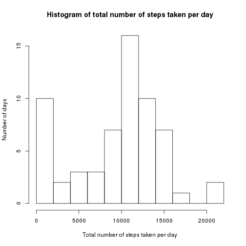
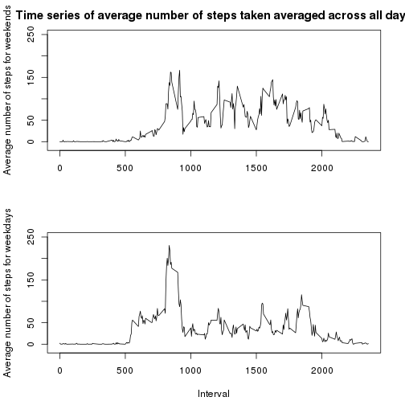

 
# Reproducible Research: Peer Assignment 1

## Introduction

It is now possible to collect a large amount of data about personal movement using activity monitoring devices such as a Fitbit, Nike Fuelband, or Jawbone Up. These type of devices are part of the “quantified self” movement – a group of enthusiasts who take measurements about themselves regularly to improve their health, to find patterns in their behavior, or because they are tech geeks. But these data remain under-utilized both because the raw data are hard to obtain and there is a lack of statistical methods and software for processing and interpreting the data.


## Data

This assignment makes use of data from a personal activity monitoring device. This device collects data at 5 minute intervals through out the day. The data consists of two months of data from an anonymous individual collected during the months of October and November, 2012 and include the number of steps taken in 5 minute intervals each day.

The variables included in this dataset are:
- steps: Number of steps taking in a 5-minute interval (missing values are coded as NA)
- date: The date on which the measurement was taken in YYYY-MM-DD format
- interval: Identifier for the 5-minute interval in which measurement was taken

The dataset is stored in a comma-separated-value (CSV) file and there are a total of 17,568 observations in this dataset.


## Loading and preprocessing the data

First, we unzip the data and load it into R.  
At the same time, we set all output to display up to 2 decimal places and suppress scientific notation.


```r
data <- read.csv(unz("activity.zip", "activity.csv"))
options(digits = 2, scipen = 999)
```


## What is mean total number of steps taken per day?

*For this part of the assignment, you can ignore the missing values in the dataset.  
1. Calculate the total number of steps taken per day  
2. If you do not understand the difference between a histogram and a barplot, research the difference between them. Make a histogram of the total number of steps taken each day  
3. Calculate and report the mean and median of the total number of steps taken per day*

First, we process the data using the aggregate function to answer this question. We aggregate the data by summing up the number of steps taken on the same day.


```r
data_1 <- aggregate(data$steps, by = list(data$date), FUN = sum, na.rm = TRUE)
names(data_1) <- c("date", "steps")
```

We can plot a histogram showing the total number of steps taken each day as well as calculate the mean and median of the total number of steps taken per day

```r
hist(data_1$steps, nclass = 10, xlab = "Total number of steps taken per day", ylab = "Number of days", main = "Histogram of total number of steps taken per day")
```

 

```r
mean_1 <- mean(data_1$steps)
median_1 <- median(data_1$steps)
```

The mean number of steps taken per day is 9354.23 steps and the median is 10395 steps.


## What is the average daily activity pattern?

*1. Make a time series plot (i.e. type = "l") of the 5-minute interval (x-axis) and the average number of steps taken, averaged across all days (y-axis)  
2. Which 5-minute interval, on average across all the days in the dataset, contains the maximum number of steps?*  

Similar to the previous question, we first start processing the raw data by getting the mean of the steps taken for each interval across all days using the aggregate function.


```r
data_2 <- aggregate(data$steps, by = list(data$interval), FUN = mean, na.rm = TRUE)
names(data_2) <- c("interval", "steps")
```

We then plot a time series of the 5-minute interval and the average number of steps taken, averaged across all days. The interval with the highest average number of steps taken can be obtained using the which.max function.


```r
plot(data_2$interval, data_2$steps, type = "l", xlab = "Interval", ylab = "Average number of steps", main = "Time series of average number of steps taken averaged across all days")
```

 

```r
max_data_2 <- data_2[which.max(data_2$steps),]
```

The 5-minute interval that contains the maximum average number of steps taken across all days is the interval 835 - 840 with an average of 206.17 steps taken.

## Inputing missing values

*Note that there are a number of days/intervals where there are missing values (coded as NA). The presence of missing days may introduce bias into some calculations or summaries of the data.  
1. Calculate and report the total number of missing values in the dataset (i.e. the total number of rows with NAs)  
2. Devise a strategy for filling in all of the missing values in the dataset. The strategy does not need to be sophisticated. For example, you could use the mean/median for that day, or the mean for that 5-minute interval, etc.  
3. Create a new dataset that is equal to the original dataset but with the missing data filled in.  
4. Make a histogram of the total number of steps taken each day and Calculate and report the mean and median total number of steps taken per day. Do these values differ from the estimates from the first part of the assignment? What is the impact of imputing missing data on the estimates of the total daily number of steps?*  


```r
na_count <- sum(is.na(data))
```

There are 2304 entries with missing values in the dataset.

To create a new dataset by filling in missing values in the dataset, we will be using the mean of the steps taken for each interval across all days as a basis for inputing missing values to create a new dataset. This has already been calculated in the previous part and stored as data_2. 

We use a logical vector and a while loop to replace all missing values.


```r
na_logical <- is.na(data$steps)
data_3 <- data
i <- 1	
while (i <= nrow(data)){
	if (na_logical[i] == TRUE){
		data_3$steps[i] <- data_2$steps[which(data_2$interval == data_3$interval[i])]
		} 
	i <- i + 1
}
```

Once we have the new dataset, we can repeat the steps in part 1. We aggregate the new data by summing up the number of steps taken on the same day, plot a histogram and calculate the mean and median.


```r
data_3_agg <- aggregate(data_3$steps, by = list(data$date), FUN = sum, na.rm = TRUE)
names(data_3_agg) <- c("date", "steps")
hist(data_3_agg$steps, nclass = 10, xlab = "Total number of steps taken per day", ylab = "Number of days", main = "Histogram of total number of steps taken per day")
```

 

```r
mean_3 <- mean(data_3_agg$steps)
median_3 <- median(data_3_agg$steps)
mean_change <- mean_3 - mean_1
median_change <- median_3 - median_1
```

The revised mean number of steps taken per day is 10766.19 steps with a absolute change of 1411.96 steps and the revised median is 10766.19 steps with a change of 371.19 steps.


## Are there differences in activity patterns between weekdays and weekends?

*For this part the weekdays() function may be of some help here. Use the dataset with the filled-in missing values for this part.  
1. Create a new factor variable in the dataset with two levels – “weekday” and “weekend” indicating whether a given date is a weekday or weekend day.  
2. Make a panel plot containing a time series plot (i.e. type = "l") of the 5-minute interval (x-axis) and the average number of steps taken, averaged across all weekday days or weekend days (y-axis). See the README file in the GitHub repository to see an example of what this plot should look like using simulated data.*  


We create a new factor variable in the dataset indicating whether a date is a weekday or weekend using as.Date and weekdays function.
Splitting the data into 2 sets, we can then aggregate them to get the average number of steps for each interval for both sets of data.


```r
weekday_data <- weekdays(as.Date(data_3$date))
isweekend <- factor(weekday_data %in% c ("Saturday", "Sunday"), labels = c("weekday", "weekend"))

data_4 <- cbind(data_3, isweekend)
data_4_weekday <- data_4[isweekend == "weekday",]
data_4_weekend <- data_4[isweekend == "weekend",]

data_4_weekday_agg <- aggregate(data_4_weekday$steps, by = list(data_4_weekday$interval), FUN = mean, na.rm = TRUE)
names(data_4_weekday_agg) <- c("interval", "steps")
data_4_weekend_agg <- aggregate(data_4_weekend$steps, by = list(data_4_weekend$interval), FUN = mean, na.rm = TRUE)
names(data_4_weekend_agg) <- c("interval", "steps")
```
We then plot the time series of average number of steps taken averaged across all days for both the two data sets and plot it in a panel graph.


```r
par(mfrow = c(2,1), mai = c(0.9, 0.82, 0.52, 0.42))

plot(data_4_weekend_agg$interval, data_4_weekend_agg$steps, type = "l", xlab = "", ylab = "Average number of steps for weekends", main = "Time series of average number of steps taken averaged across all days", ylim=c(-10,250))
plot(data_4_weekday_agg$interval, data_4_weekday_agg$steps, type = "l", xlab = "Interval", ylab = "Average number of steps for weekdays", ylim=c(-10,250))
```

 


